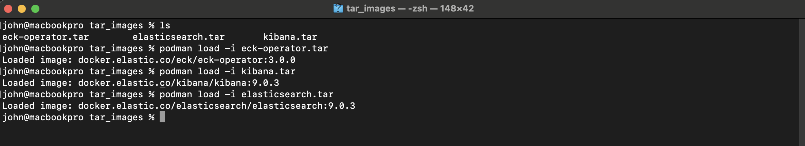
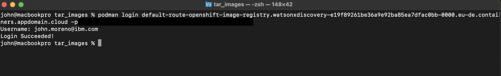
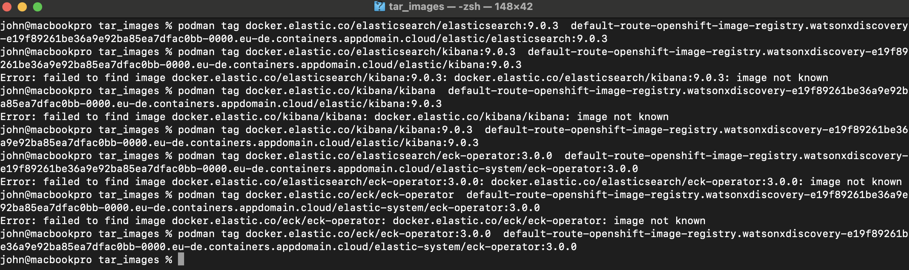
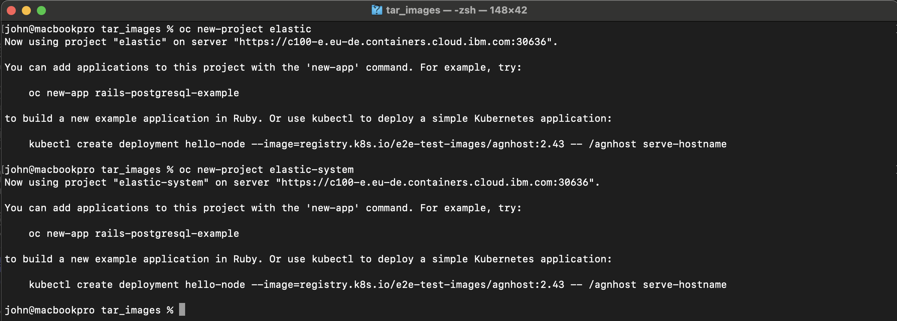
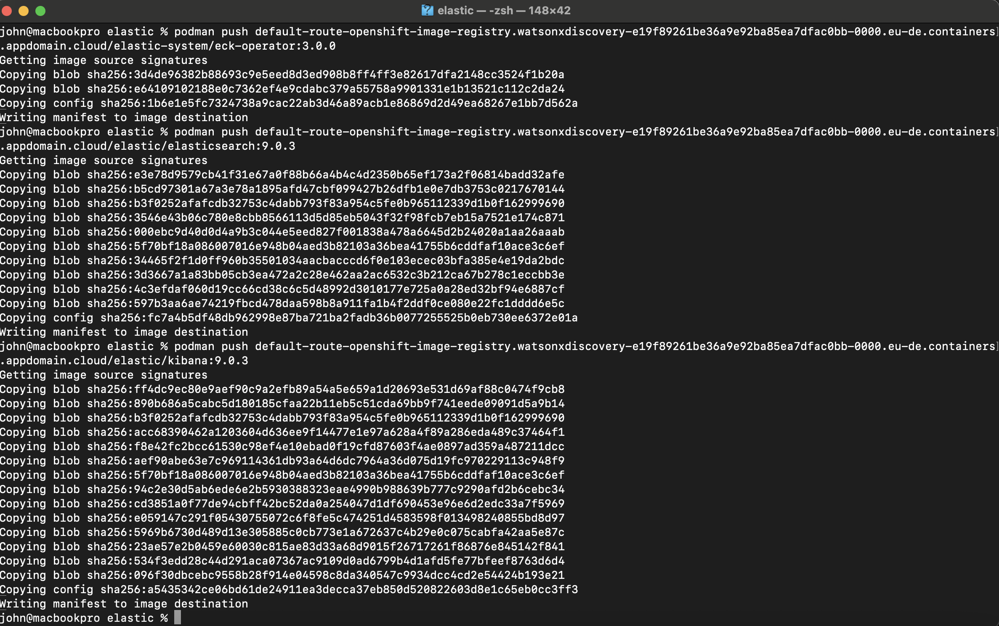
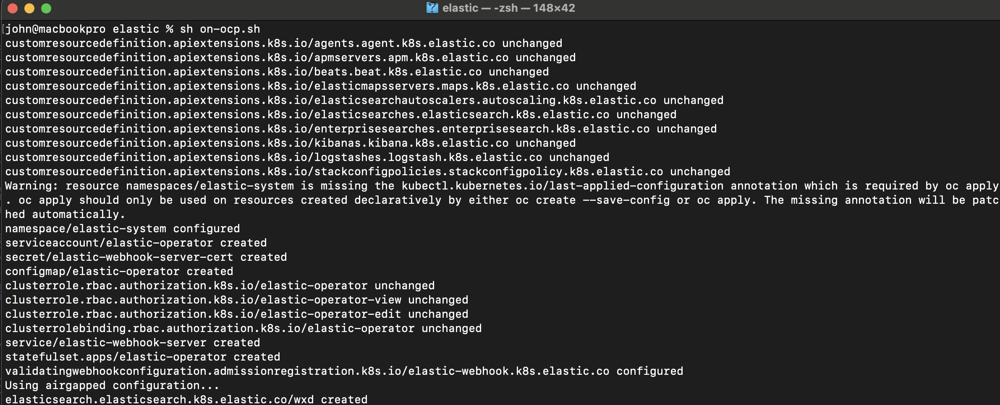
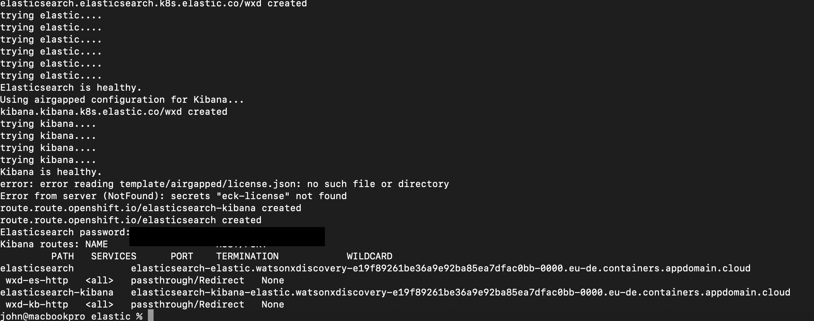
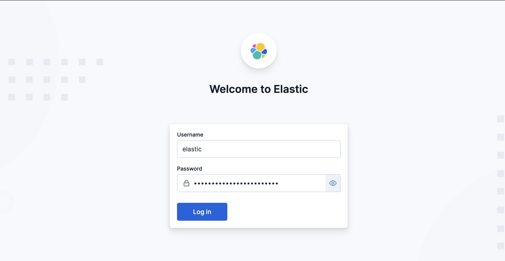
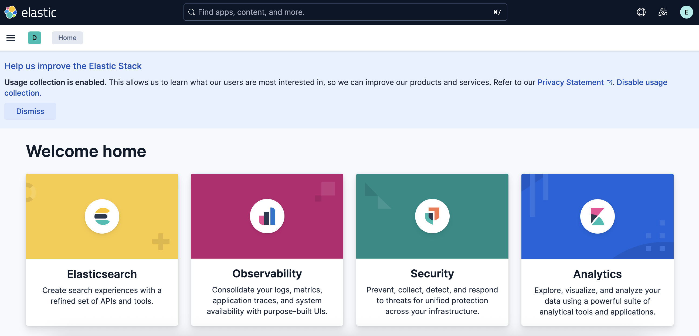

# IBM watsonx Discovery Installation Guide on OpenShift (OCP) Airgapped Environment

##  General Information

- **Product**: IBM watsonx Discovery  
- **Version**: 9.0.3  
- **Deployment environment**: OpenShift Container Platform (OCP) - Airgapped  
- **Installation date**: 18/07/2025  

---

##  Installer Information

- **Installer name**: John Moreno  
- **Email**: john.moreno@ibm.com  
- **Role/Title**: Solutions Architect  
- **Company / Organization**: IBM ExpertLabs

---

##  Prerequisites

###  Infrastructure

- OpenShift Container Platform: 4.14 
- Access to download Images
- Access to git repository
- Internal/private container image registry  
- Bastion machine to download the images
- Elastic License
- [CRDs.yaml](https://download.elastic.co/downloads/eck/3.0.0/crds.yaml)
- [operator.yaml](https://download.elastic.co/downloads/eck/3.0.0/operator.yaml)

###  Software Requirements

- Podman / Docker for image management  


---

##  Environment Preparation

1. Validate OCP cluster status and node health  
2. [Download the images from IBM SharePoint](https://ibm-my.sharepoint.com/:f:/p/miguel_sancho_pena1/EmZFCN_r5XRDnxv3xp7IenoBJJHepwZ5s_QGprj92eMxow?email=john.moreno%40ibm.com&e=aAdpql)  
3. Clone the project repository to your local machine:

```bash
git git@github.com:jmorenor86/scaffolding-infra.git
cd scaffolding-infra
```
---
4. Download license in json format
```json 
{
    "license": {
       
    }
}
```

5. Download the images and load into bastion
```bash 
podman load -i <PATH_FOLDER_DOWNLOAD_IMAGES>/elasticsearch.tar
podman load -i <PATH_FOLDER_DOWNLOAD_IMAGES>/kibana.tar
podman load -i <PATH_FOLDER_DOWNLOAD_IMAGES>/eck-operator.tar
```
e.g.



6. Modify the file on-ocp.sh 

```bash 
# Set to true if installing in an airgapped (disconnected) environment; false otherwise.
# Controls which templates and resources the script uses during deployment.
export AIRGAPPED=true
# Set to true if you are already logged into the OCP cluster
# Set to false if you want the script to log in using OCP_HOST, OCP_USER, and OCP_PASSWORD
export EXIST_LOGIN_OCP=true
export OCP_HOST="CHANGE_ME"
export OCP_USER="CHANGE_ME"
export OCP_PASSWORD="CHANGE_ME"
## Variables for setting up the Elastic cluster
export ES_NAMESPACE="elastic"
export ES_CLUSTER="wxd"
export ES_STORAGE="50Gi"
export ES_VERSION="9.0.3"
export ES_NODES="3"
export ES_CONTAINER_NAME="elasticsearch"
export ES_CONTAINER_REQUEST_MEMORY="8Gi"
export ES_CONTAINER_REQUEST_CPU="2"
export ES_CONTAINER_LIMIT_MEMORY="8Gi"
export ES_CONTAINER_LIMIT_CPU="8"
## change to the storage class you need to use 
export STORAGECLASS="CHANGE_ME"
## Path to the crds.yaml
export ES_ECK_CRDS="CHANGE_ME"
## Path to the operator.yaml
export ES_ECK_OPERATOR="CHANGE_ME"
## Path to the license file
export LICENSE_FILE="CHANGE_ME"
```
---

## watsonx Discovery Installation

### Step 1: Log in to the container registry using Podman or Docker

```bash
podman login default-route-openshift-image-registry.apps.ocpuat1.caas.central.root.alpha.gr -p  <TOKEN>

```
e.g.



### Step 2: Tagging the images
```bash
podman tag docker.elastic.co/elasticsearch/elasticsearch:9.0.3 default-route-openshift-image-registry.apps.ocpuat1.caas.central.root.alpha.gr/elastic/elasticsearch:9.0.3
podman tag docker.elastic.co/elasticsearch/kibana:9.0.3 default-route-openshift-image-registry.apps.ocpuat1.caas.central.root.alpha.gr/elastic/kibana:9.0.3
podman tag docker.elastic.co/elasticsearch/eck-operator:3.0.0 default-route-openshift-image-registry.apps.ocpuat1.caas.central.root.alpha.gr/elastic-system/eck-operator:3.0.0
```
e.g.


### Step 3: Create projects
```bash
oc new-project elastic
oc new-project elastic-system
```
e.g.


### Step 4: Create Images Stream 
```bash
oc create is elasticsearch -n elastic
oc create is kibana -n elastic
oc create is  eck-operator -n elastic-system
```
### Step 5: Push the images 
```bash
podman push default-route-openshift-image-registry.apps.ocpuat1.caas.central.root.alpha.gr/elastic/elasticsearch:9.0.3
podman push default-route-openshift-image-registry.apps.ocpuat1.caas.central.root.alpha.gr/elastic/kibana:9.0.3
podman push default-route-openshift-image-registry.apps.ocpuat1.caas.central.root.alpha.gr/elastic-system/eck-operator:3.0.0
```
e.g.



### Step 6: Modify the files
operator.yaml 
```yaml
spec:
      terminationGracePeriodSeconds: 10
      serviceAccountName: elastic-operator
      automountServiceAccountToken: true
      securityContext:
        runAsNonRoot: true
      containers:
      - image: "CHANGE-ME"
        imagePullPolicy: Always

```
replace with: image-registry.openshift-image-registry.svc:5000/elastic-system/eck-operator:3.0.0

template/airgapped/elastic-cluster.sh.j2
```yaml
 containers:
            - name: ${ES_CONTAINER_NAME}
              image: CHANGE_ME # path to container registry
              resources:
                requests:
                  memory: ${ES_CONTAINER_REQUEST_MEMORY}
                  cpu: ${ES_CONTAINER_REQUEST_CPU}
                limits:
                  cpu: ${ES_CONTAINER_LIMIT_CPU}
                  memory: ${ES_CONTAINER_LIMIT_MEMORY}

```
replace with: image-registry.openshift-image-registry.svc:5000/elastic/elasticsearch:${ES_VERSION}


template/airgapped/kibana-instance.sh.j2
```yaml
spec:
      containers:
        - name: kibana
          image: CHANGE_ME # path to container registry
          env:
            - name: NODE_OPTIONS
              value: "--max-old-space-size=2048"

```
replace with: image-registry.openshift-image-registry.svc:5000/elastic/kibana:${ES_VERSION}

### Step 7: Run the on-ocp.sh
```bash
./on-ocp.sh
```
e.g.






### Step 8: Open the Kibana route 
- user: elastic
- password: in console







# Create users for elastic search

## ROLE

```json
PUT /_security/role/role-index-test
{
  "cluster": ["all"],
  "indices": [
    {
      "names": ["my-index-*"],
      "privileges": ["read", "write"]
    }
  ]
}
```

https://www.elastic.co/docs/api/doc/elasticsearch/operation/operation-security-put-role

## User

```json
POST /_security/user/jmoreno
{
  "password" : "elastic-test",
  "roles" : ["role-index-test"],
  "full_name" : "John Moreno",
  "email" : "john.moreno@ibm.com"
}
```

https://www.elastic.co/docs/api/doc/elasticsearch/operation/operation-security-put-user

